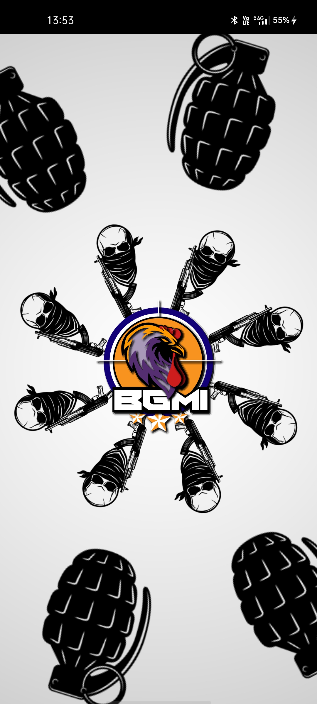

# Companion-Battleground-Android App

     
    
    

     
    

api url :https://fcm.googleapis.com/fcm/send

header:
      Content-Type:application/json
      Authorization:key= notification sever key
      
      {
 "to" : firebaseDeviceToken,
 "collapse_key" : "type_a",
 "notification" : {
     "body" : "Body : Notification",
     "title": "Title : Notification",
     "image":"https://www.learndash.com/wp-content/uploads/Notification-Add-on.png"
     
 },
 "data" : {
     "body" : "Body : Data",
     "title": "Title : Data",
     "image":"https://metaltechalley.com/wp-content/uploads/2017/09/data.jpg"
     
 }
}

      
notification serverKey : AAAAuNiuMe4:APA91bEslOGFa1vwirG_jLxsAk3xLORhLJ7YFmfcM9MnLYaCfdF030smALgqRiV4xf4WsTBHST4qJZOKtq33vxakoi2nXB4cuztEd4eX2cujO8B7pRNXqfN8xYXgbZdUi2VrRpPELbgh
